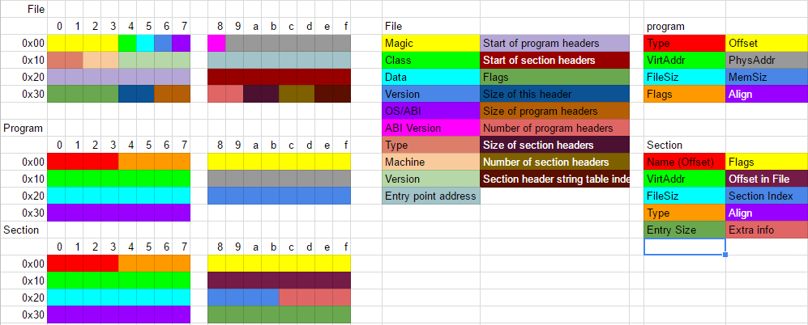

Resources on ELF:

-   [Making teensy programs](http://www.muppetlabs.com/~breadbox/software/tiny/teensy.html)
    -   goes down to 45 bytes
-   [Undestanding ELF](https://medium.com/@MrJamesFisher/understanding-the-elf-4bd60daac571)
    -   Good high level overview / motivation explaner
-   [Overview of ELF and how to inspect it using tools](https://linux-audit.com/elf-binaries-on-linux-understanding-and-analysis/)
-   [Overview of basic format](https://en.wikipedia.org/wiki/Executable_and_Linkable_Format)
-   [Spec for 64 bit](https://www.uclibc.org/docs/elf-64-gen.pdf)
    -   has 64 bit program section format
-   [Full spec](http://docs.oracle.com/cd/E23824_01/pdf/819-0690.pdf) - includes a lot of extra stuff we don't need
    Overview of ELF:
-   Used for linking, dynamic libraries, executables
-   Format
    -   General format is File header, ... (normally nothing here), Program Headers (not needed for dyn. lib. or object files), ... (data, code, etc), section headers (not needed for executables)
    -   

Assembly:

```asm
; tiny.asm
BITS 64
GLOBAL _start
SECTION .bss
str:resb 1
SECTION .text
_start:
        mov     [str], byte 10
        mov     edx,1     ;message length
        mov     ecx,str    ;message to write
        mov     ebx,1       ;file descriptor (stdout)
        mov     eax,4       ;system call number (sys_write)
        int     0x80        ;call kernel
        mov     eax, 1
        mov     ebx, 42
        int     0x80
```
